# Absolute Order

**Absolute Order** (formerly *Chest Separators*) turns vanilla containers into a rule-driven storage system: paint colored zones directly on the chest GUI, attach strict per-slot item filters to them, and empty your whole inventory into the right slots with a single click.

This README is written for developers and focuses on how the mod is built. If you are a player looking for features, downloads and setup, head to the [Modrinth page](https://modrinth.com/mod/absolute-order).

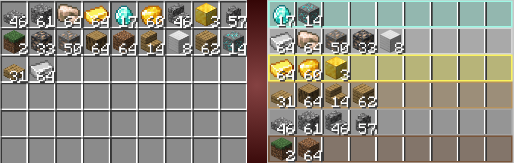

---

## Project Scope

- ~9,700 lines of Java across 57 classes
- 16 targeted Mixins covering every vanilla item-insertion path
- Client-server architecture with 5 custom network payloads and concurrency locking
- Persistence built on Codecs and the Data Components API
- EMI, REI and ModMenu integrations
- Localized into 20 languages

The project shipped as a purely client-side visual overlay (*Chest Separators*, v1.0 to v1.2). Version 1.3 was a full re-architecture: the rendering-only mod became a synchronized client-server system with real gameplay mechanics, while keeping the original visual toolset intact.

---

## Feature Tour

### One Click Deposit

Press one button and every item in your inventory that matches a chest filter flies into its designated slot. Holding Shift extends the deposit to unfiltered slots as well.

### Visual Zone Painting

Two drawing modes are available: Area mode fills large rectangular regions by dragging, while Trace mode paints irregular layouts slot by slot with precision. An eyedropper copies any color already on screen.

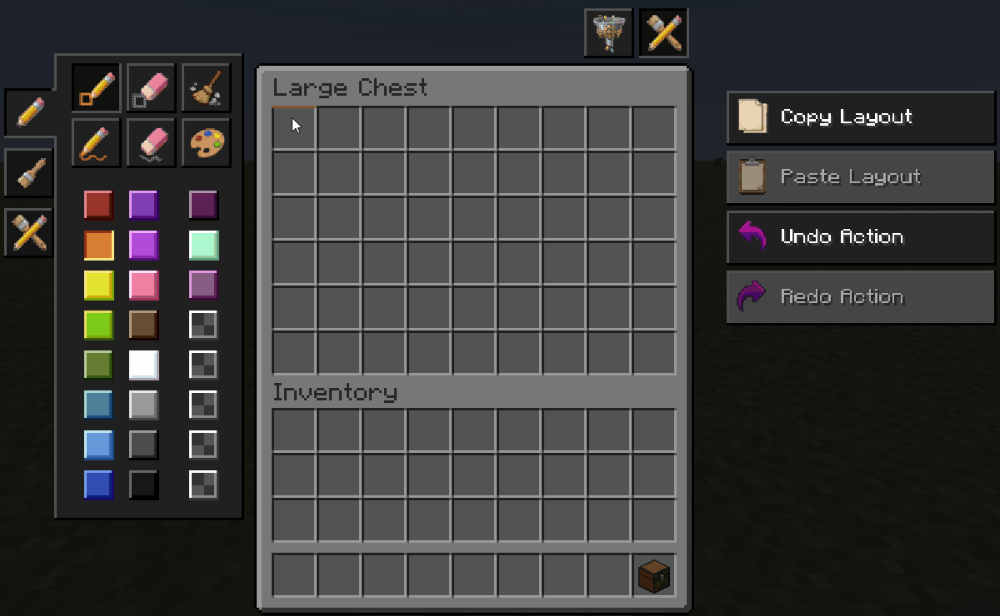

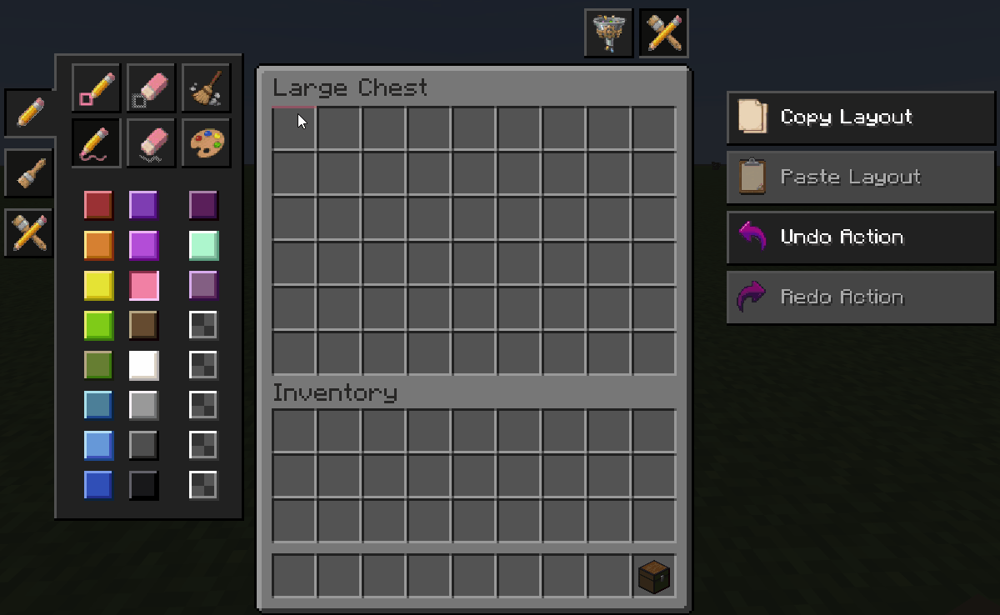

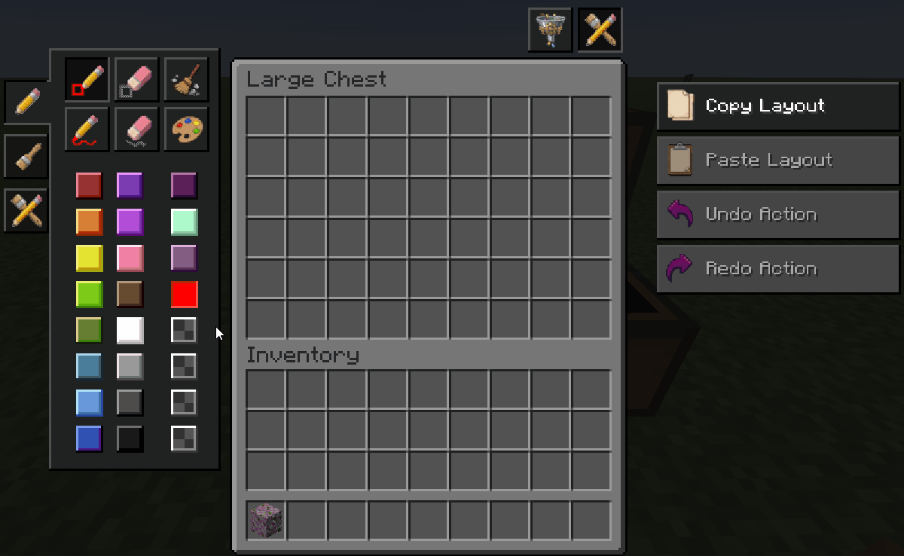

### Per Slot Filtering

Any painted zone can be given an absolute filter: a whitelist of items that are allowed to enter its slots. Filters are edited in a custom GUI with search, and can be populated three ways: importing the items physically present in the selected slots, importing every match of a search query at once, or importing a whole item tag (all logs, all stones) with one click.

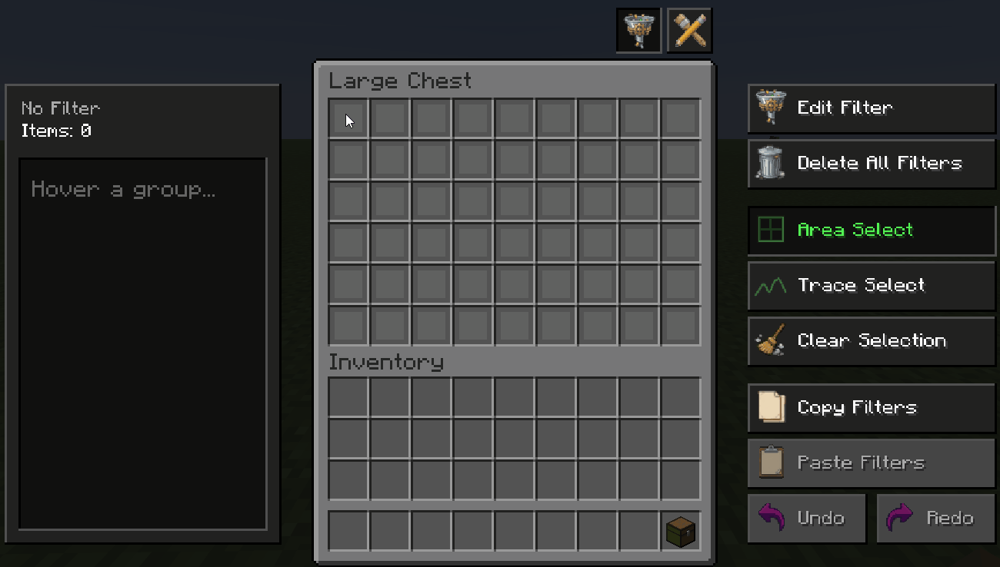

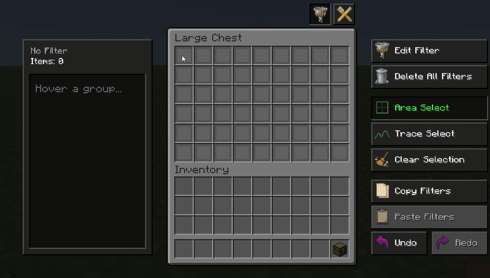

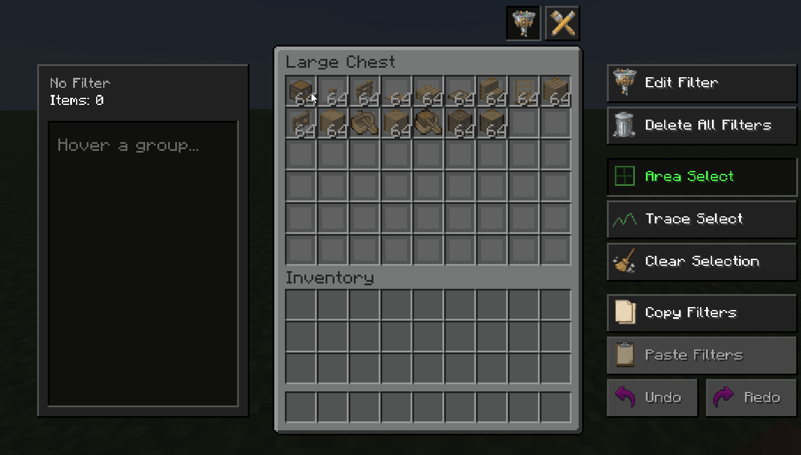

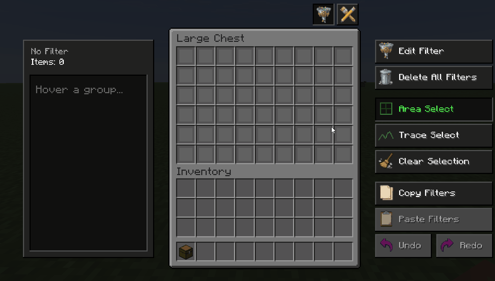

More import workflows

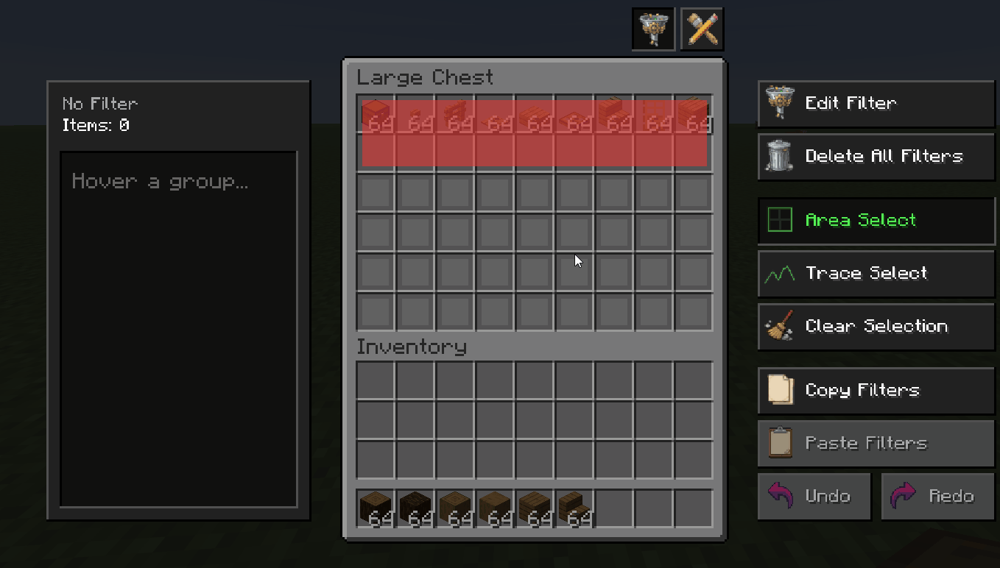

### Strict Enforcement

Filters are not a suggestion. Manual clicks, shift-clicks and hopper insertions are each checked independently, and a rejection animation plays when an invalid item is denied. Each of the three channels can be toggled per slot.

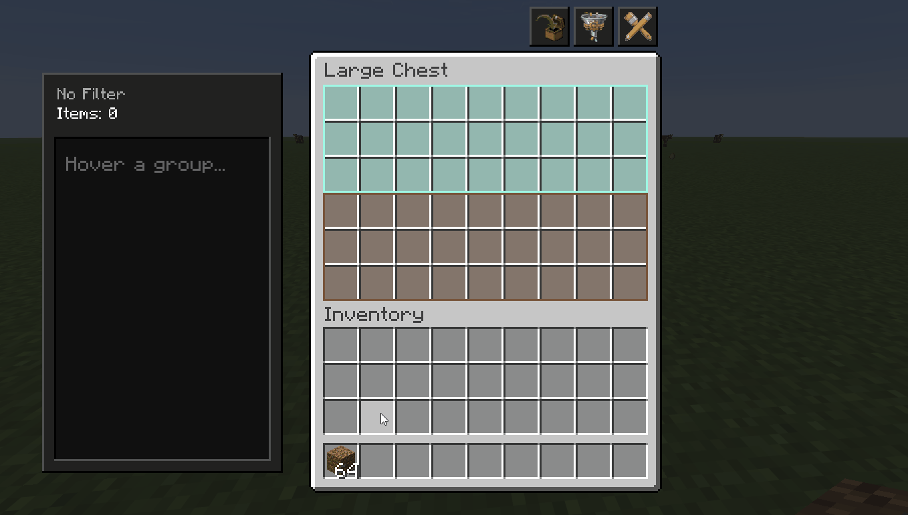

### Configuration

An extensive config menu (accessible through ModMenu) splits options into client visuals — dark mode, panel visibility, animations, background and line transparency — and server mechanics, such as whether containers actively expel invalid items.

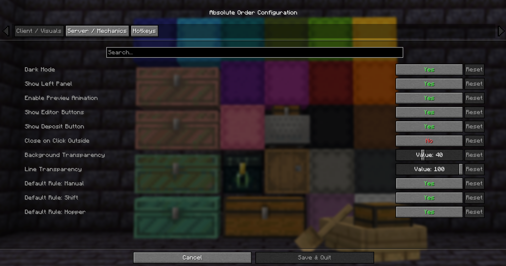

More configuration screens

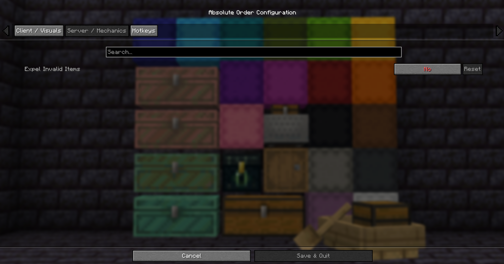

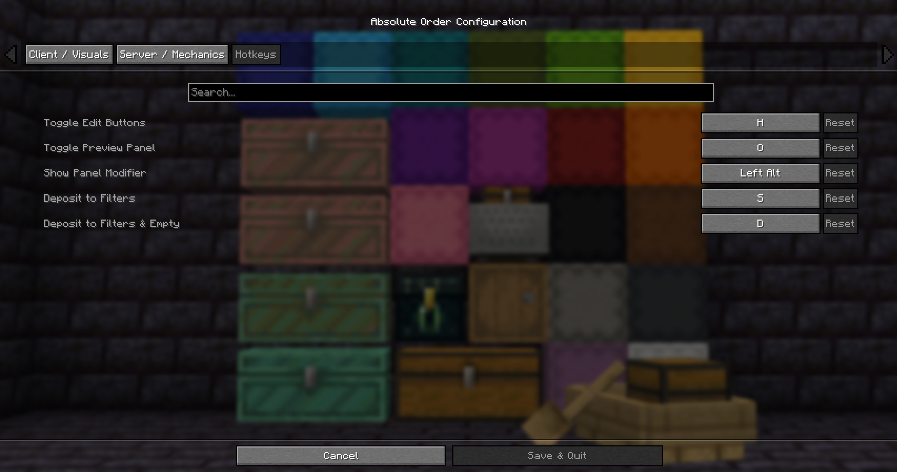

### Universal Container Support

Works with chests, double chests, barrels, ender chests, shulker boxes, minecarts and boats with chests, and many modded storage containers.

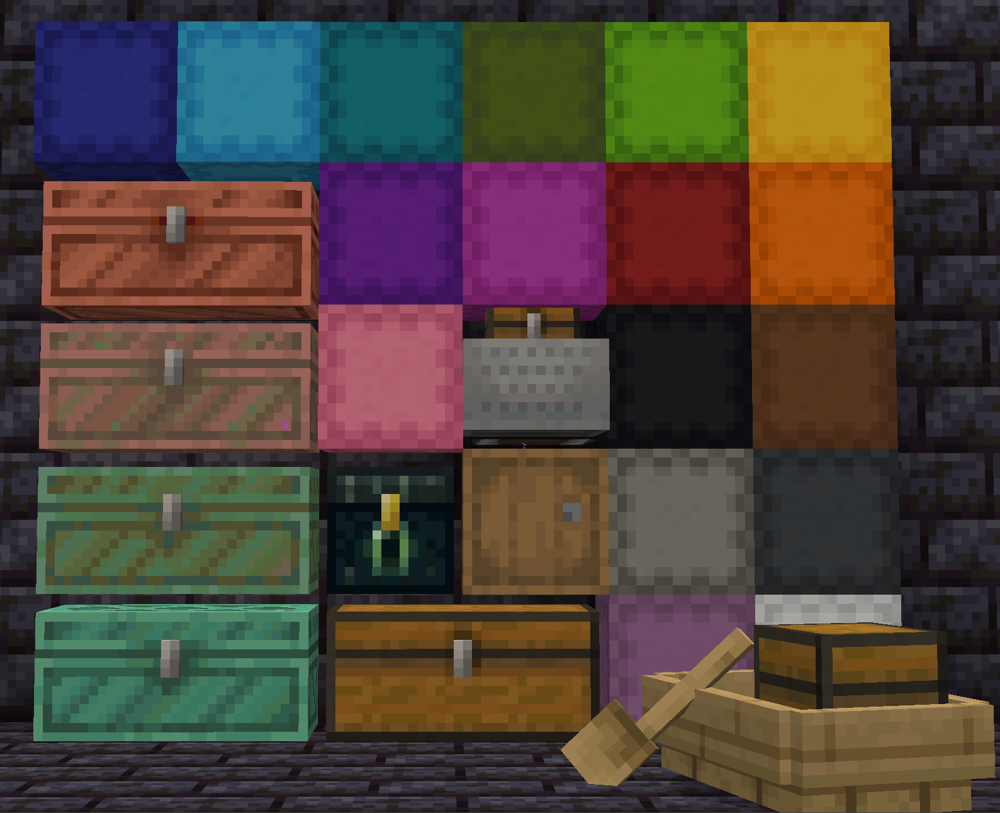

---

## Engineering Notes

The parts of this project that were genuinely hard, and how they are solved.

### Deposit Through Vanilla Interactions Only

The deposit algorithm never teleports items with a custom packet. The client computes a movement plan and then replays it as a sequence of vanilla `clickSlot` interactions, so the server validates every single move exactly as if a human had clicked. This keeps the mod compatible with vanilla anti-duplication logic and avoids any desync between what the player sees and what the server stores.

Target slots are collected in four priority passes: filtered slots that already stack the item, empty filtered slots, and — only while Shift is held — unfiltered stacking and unfiltered empty slots. Before the click even happens, a live preview simulates the outcome by tracking the remaining count of every source slot and the incoming stack of every target slot.

### Concurrency Control for Shared Containers

Two players opening the editor on the same chest is a race condition. The server keeps a `ConcurrentHashMap<BlockPos, UUID>` of editor locks; a lock request atomically covers both halves of a double chest (the neighbor is resolved from `ChestType` and facing), and all locks held by a player are released when they disconnect. Whitelist updates are broadcast to every player currently tracking that block position, so open screens stay in sync.

### Persistence With Codecs and Data Components

Each configured slot is a `SlotWhitelist` record carrying its group id, allowed item list and the three per-channel toggles. The record has two serialized forms: a DataFixerUpper `Codec` for world persistence and a `PacketCodec` for the network. Container-level data is attached through custom Data Component types, including an `unboundedMap` codec that bridges string keys (required by serialization) to integer slot indices (used at runtime) via `xmap`.

This is what makes shulker boxes fully portable: a dedicated UUID component keeps the box linked to its layout and filters through the entire break, carry and place cycle, with no external bookkeeping.

### Enforcement Via Targeted Mixins

Every insertion path in vanilla Minecraft goes through different code, so each one is intercepted at its own choke point:

- Manual clicks are filtered through the slot insertion check.
- Shift-clicks use a `@Redirect` on the `canInsert` call inside `ScreenHandler.insertItem`, so quick-move respects the whitelist without touching the rest of the transfer logic.
- Hoppers and other automation are stopped at the head of `HopperBlockEntity.canInsert`.
- Double chests are reconstructed as a `DoubleInventory` so both halves share a single rule set.

When the expulsion option is enabled, the server physically ejects non-compliant items toward the player: the direction vector is normalized and a small Gaussian spread is applied so stacks do not pile on a single point.

### A Small UI Framework

The in-container editor grew into a self-contained UI layer with clear separation of concerns: rendering, input handling, layout, hit-testing geometry and session state each live in their own class, with a custom widget set and dedicated sub-screens for the color picker, line drawing, filter editing and group overview.

The v1.1 foundations are still in place underneath: raycast-based drag painting for fluid input, and a real-time HSV color engine with eight persistent custom palette slots.

---

## Multiplayer Notes

Zone painting and layouts work on any server. For the full v1.3 feature set — server-validated filter enforcement, editor locking and shulker persistence — the mod must also be installed on the server.

## Building From Source

The project is a standard Fabric Loom setup. Clone the repository, open it as a Gradle project and run the `build` task with Java 21. The jar is produced in `build/libs`.

## License

All rights reserved. The source is published for reading and reference. You are welcome to include the released mod in your modpacks.

---

## Support my work

If you enjoy my mods, consider supporting me on Ko-fi. It helps me spend more time building, updating and improving them.

- Leave a one-time tip if you like my work
- Request a custom feature, tweak or a whole new mod
- Become a monthly member for priority requests, a say in what I build next, your name in the mod credits, and access to my Discord community

