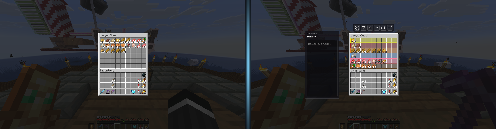
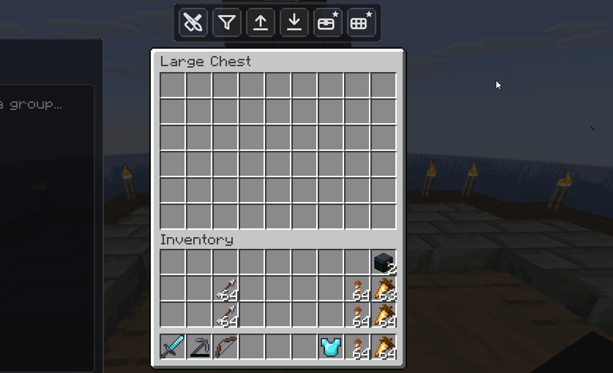
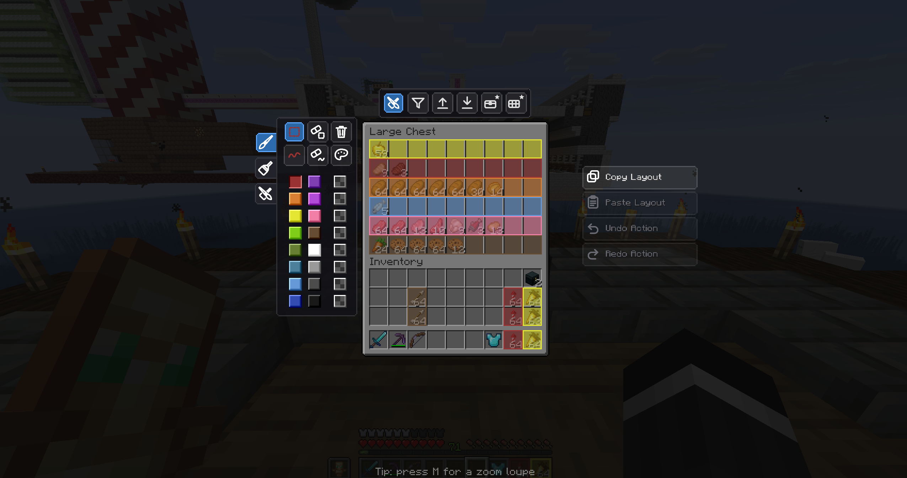
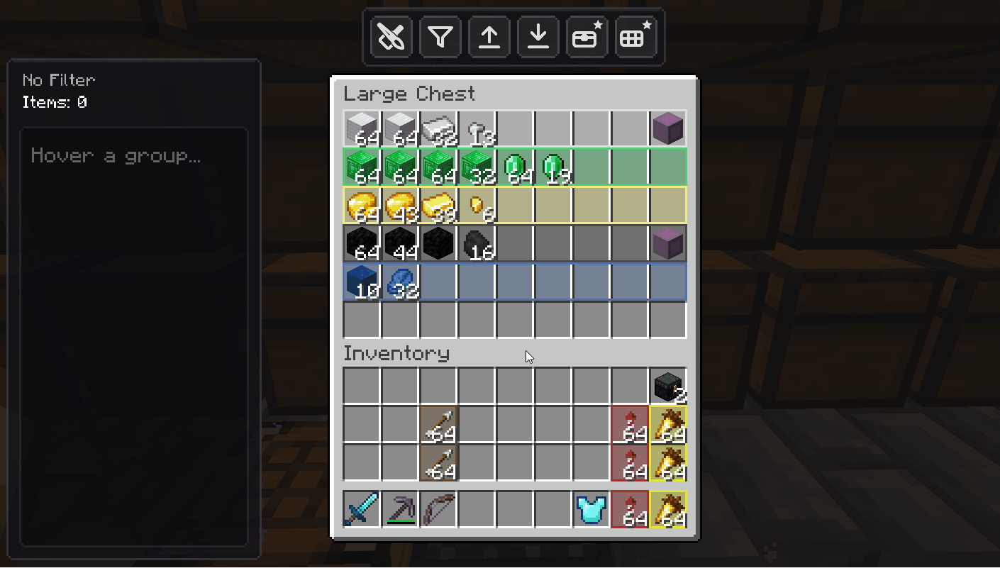
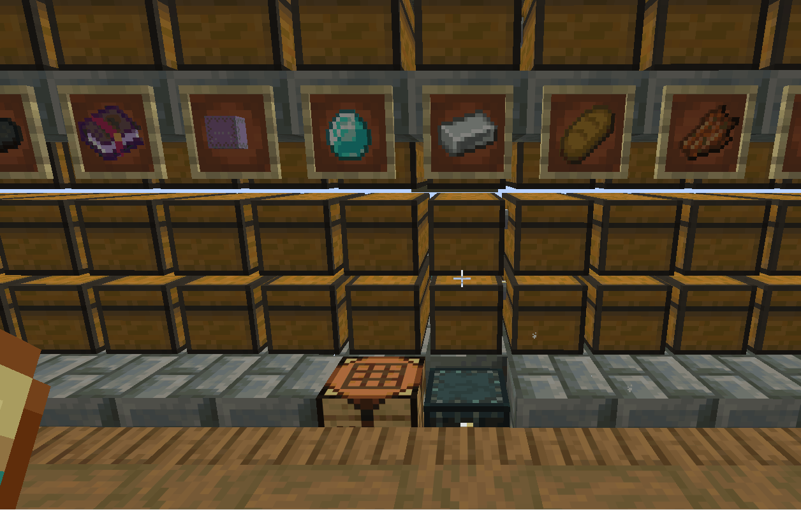
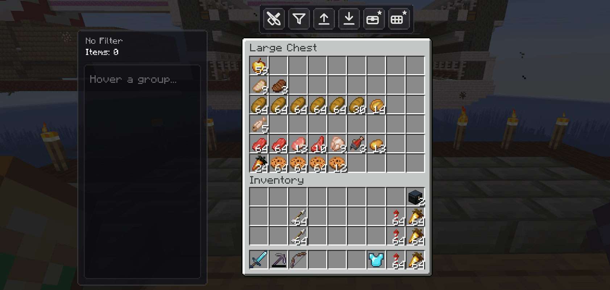
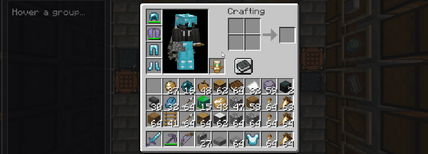
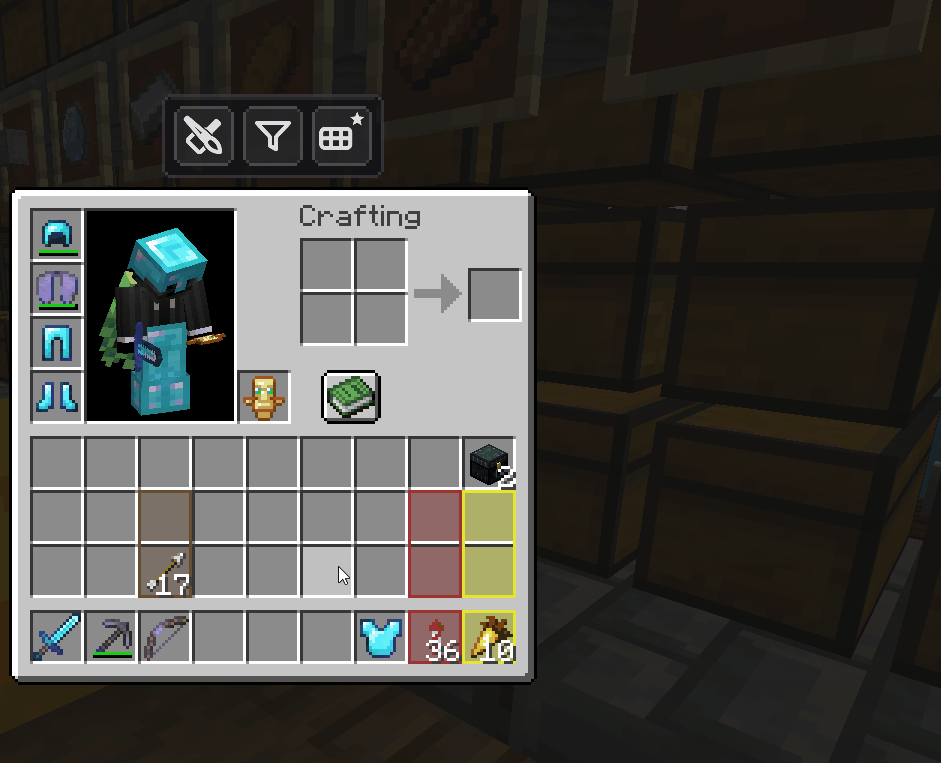
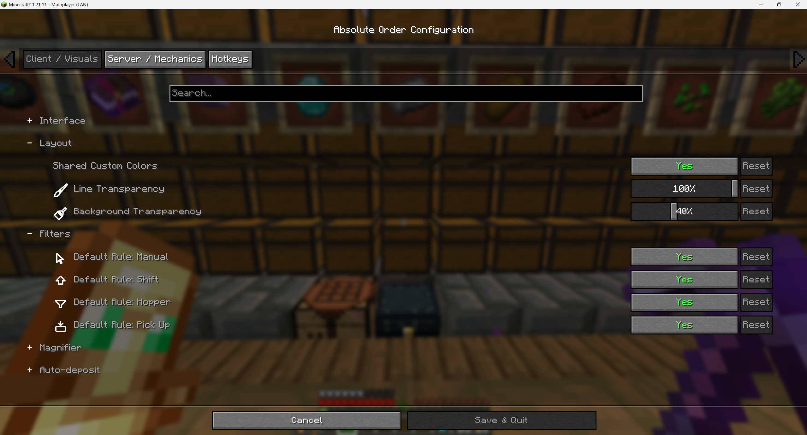
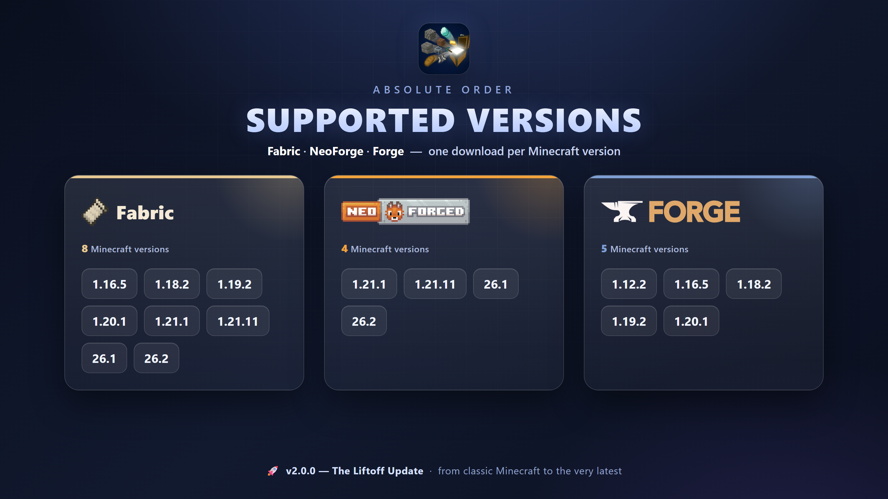

# 📦 Absolute Order | Multi-Loader Inventory Engineering


**Absolute Order** (formerly *Chest Separators*) is an inventory-organization mod built around a **Virtual Overlay System**: instead of crafting physical dividers that waste slots, it paints separators and per-slot filters directly onto the container GUI, and enforces those filters server-side for real item-routing behavior (shift-click, hoppers, auto-deposit).

Version **2.0 — "The Liftoff Update"** rebuilt the project from a single Fabric mod into **one shared codebase that ships for Fabric, NeoForge and Forge across nine Minecraft versions** (1.12.2 → 26.2), spanning five distinct rendering eras.



> **⚠️ Engineering Focus**
> This project is a study in **cross-version portability**: a common source set driven by **Architectury** + **Mojmap/Parchment**, an abstraction over five rendering eras (from legacy `MatrixStack` to modern `RenderPipelines`), a **server-authoritative persistence layer** using Data Components / chunk NBT, and heavy **Java bytecode manipulation** via SpongePowered Mixins for insertion rules, hopper routing and GUI hooks.

---

## 🧩 Feature Set

### 1. Visual Separators — client-local overlay
Colored lines between slots and per-slot backgrounds painted onto any container GUI. A custom slot-hitting algorithm allows fluid **drag & paint** (pencil/brush/area/trace) across the grid, rendered on the client tick for zero input lag. A real-time **HSV→RGB engine** generates any of 16.7M colors with an eyedropper and per-layer custom palettes, and layouts are deep-copied through an **NBT clipboard** to replicate a design across containers instantly.



The editor floats over the container grid with layered depth control and per-zone tools, so it never Z-fights with the slots underneath.



### 2. Whitelist Filters — server-authoritative
Per-slot rules deciding which items may enter a slot, built by dragging items in and out of a filter and grouping slots into one logical unit.



A filter's item order is a **priority order** you arrange by dragging — it drives which slot each item lands in, and powers one-click auto-sort. Rules are enforced for **manual placement, shift-click and hoppers** (each axis toggleable), refused at the insertion mixin rather than silently swallowed.



Whole filter setups can be saved as **presets** and reapplied to any container. Filters on **block containers travel with the block** (Data Component → chunk NBT); entity inventories and the Ender Chest are client-local.



### 3. Auto-Deposit & Auto-Pull
One keystroke sweeps matching items from your inventory **into** nearby filtered storage…



…or pulls items **from** storage to top up your filtered inventory slots. Every action ships a **live preview** generated by the same ordering primitive as the real operation, so the predicted result and the server's authoritative result can never drift.



### 4. Configuration
Everything is tunable through a Cloth Config screen with rebindable keys, and the editor declares REI / EMI / JEI exclusion zones so it never overlaps recipe UIs. Localized into 20 languages.



---

## 🏗️ Technical Architecture

### Multi-loader, single source of truth
Modern ports use an Architectury **`common/` + loader modules** layout: the feature code lives once in `common`, and thin Fabric / NeoForge / Forge modules bind it to each platform's entrypoints, networking and registration. The legacy **1.12.2** port is a separate hand-written Forge project (MCP names, no Architectury) that shares the design but not the code.

### Rendering-era abstraction
The dual-layer rendering pipeline (persistent separators behind items, transient editor UI on top) is written against five eras and selected per version:

| Era | Representative | GUI primitive |
| --- | --- | --- |
| E5 | 26.1 / 26.2 / 1.21.11 | `RenderPipelines` |
| E4 | 1.21.1 / 1.20.1 | `GuiGraphics` |
| E3 | 1.19.2 | `GuiGraphics` (early) |
| E2 | 1.18.2 / 1.16.5 | `PoseStack` / `MatrixStack` |
| E1 | 1.12.2 | legacy immediate mode |

### Context-aware persistence
A **polymorphic data strategy** picks the storage path per target:
* **Block containers** → server-authoritative **Data Component** that rides the block into chunk NBT.
* **Entities** (minecarts, llamas…) → keyed by the entity's persistent `UUID`.
* **Client-local** visuals + inventory/Ender-Chest filters → per-world `.dat` NBT files.

Item-count serialization, item-equality and the resource-id API all differ by version (byte vs VarInt on the wire, `isSameItemSameComponents` vs `isSameItemSameTags` vs a meta-aware `ItemKey`); these are centralized so one change propagates cleanly across all nine ports.

### Enforcement pipeline
Insertion is a **4-pass deposit sweep** — filtered stacking → filtered filling → unfiltered stacking → unfiltered filling — and every automatic path (shift, hopper, grab, deposit) shares one `FilterPriority` ordering primitive, expressed as a *conditional refusal* so vanilla performs the actual transfer and client/server stay in agreement.

---

## 🎮 Supported Versions & Loaders



| Minecraft | Loaders | Build JDK |
| --- | --- | --- |
| 26.2, 26.1 | Fabric, NeoForge | 25 |
| 1.21.11, 1.21.1 | Fabric, NeoForge | 21 |
| 1.20.1, 1.19.2, 1.18.2, 1.16.5 | Fabric, Forge | 21 |
| 1.12.2 | Forge | 11 |

> Quilt runs the Fabric jar. Release jars are named `AbsoluteOrder-<version>-<loader>-mc<version-or-range>.jar`.

---

## 💻 Installation

1. Install the matching loader (Fabric, NeoForge, or Forge) for your Minecraft version.
2. Add the dependencies noted on the download page — **Fabric API** (Fabric) and **Architectury API** on the modern ports.
3. Drop the jar for your version + loader into your `mods` folder.

> **Multiplayer:** filters on block containers are **server-authoritative**, so the mod must be installed **on the server** for those filters to persist online. Visual separators and inventory filters are client-side and work without a modded server.

---

## 🛠️ Building from Source

Gradle + Architectury Loom, one module per version. Build a module with its required JDK:

```bash
# from a version module directory (e.g. multiloader-1.20.1/)
./gradlew build
```

JDKs: **21** for the modern ports, **25** for the 26.x ports, **11** for legacy 1.12.2.

---
*Created and maintained by **marcsanz-dev**. Looking for the internals? Start at `common/src/main/java/...` (or `src/` on 1.12.2) for the Mixin and networking implementation.*
